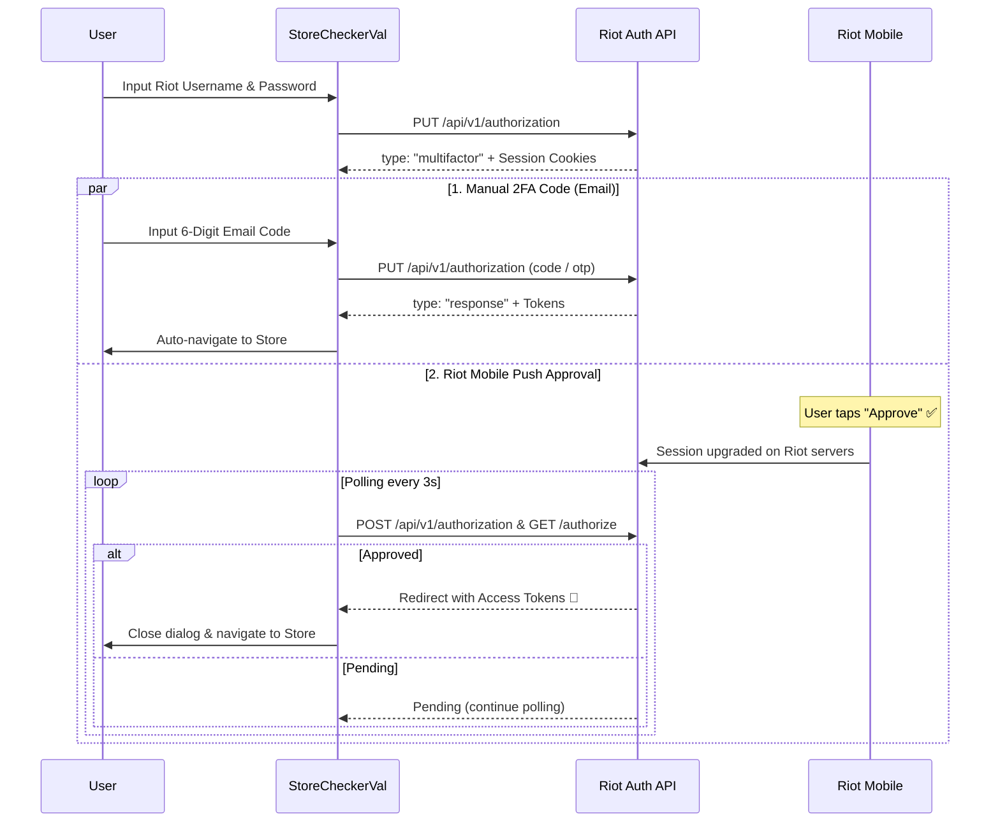

# 🎯 StoreCheckerVal (Valorant Store & Wishlist Tracker)

<div align="center">


**A modern, secure, and feature-rich Flutter application to monitor your Valorant Daily Store, Featured Bundles, Night Market, and Wishlist on mobile devices.**

[Features](#-key-features) • [Auth & 2FA Flow](#-authentication--2fa-flow) • [Tech Stack](#-tech-stack--architecture) • [Getting Started](#-getting-started) • [Contributing](#-contributing)

</div>

---

## ✨ Key Features

### 🛒 Live Storefront & Wallet Tracking
* **Daily Store Rotations**: Live 24-hour rotating offers with real VP prices, tier badges (Select, Deluxe, Premium, Ultra, Exclusive), and live reset countdowns.
* **Featured Bundles**: Browse current featured collection bundles with pricing and full skin contents.
* **Night Market Support**: Automatic detection and display of discounted Night Market card offers when active.
* **Live Wallet**: Real-time display of your Valorant Points (VP) and Radianite Points (RP).

### 🔍 Interactive Skin Details & Previews
* **High-Res Weapon Renders**: Inspect full-resolution renders and weapon models.
* **Chroma Variants & Color Swatches**: Switch between weapon color styles (Default, Red, Blue, Gold, etc.) with live preview.
* **Level Progressions**: View upgrade levels (VFX, Animations, Audio, Finishers) and stream weapon preview videos.

### 💖 Wishlist & Background Notifications
* **Skin Wishlist**: Mark any skin from the catalog as a wishlist favorite.
* **Auto-Check Alerts**: Background worker (`WorkManager`) checks daily store rotations and sends local push notifications when a wishlisted skin appears in your shop.

### 🔒 Enterprise-Grade Security & Authentication
* **Direct Riot Sign-On**: Authenticate directly with Riot Games RSO API.
* **Dual 2FA Support**:
  * **Email Verification Code**: Enter the 6-digit OTP code sent to your registered email.
  * **Riot Mobile Push Approval**: Tap **"Approve"** in your official Riot Mobile app, and the store checker automatically detects approval in real-time (ValoHub-style).
* **Web Sign-In Fallback**: In-App browser login option via official Riot authorization endpoints.
* **Biometric Lock**: Optional Fingerprint / Face ID app lock for enhanced privacy.
* **Encrypted Storage**: Credentials and session tokens are encrypted using `flutter_secure_storage` (Android Keystore / iOS Keychain).
* **Silent Cookie Reauth**: Seamless token refreshing using Riot's `ssid` session cookies without requiring password re-entry.

---

## 🔄 Authentication & 2FA Flow



---

## 🛠️ Tech Stack & Architecture

Built following **Clean Architecture** principles and **BLoC Pattern**:

* **Framework**: [Flutter](https://flutter.dev) (Dart SDK `^3.9.0`)
* **State Management**: `flutter_bloc` & `equatable`
* **Networking**: `dio` with custom interceptors for session cookies & token management
* **Data Storage**: `flutter_secure_storage` (Tokens) & `hive_flutter` (Wishlist & Cache)
* **Routing**: `go_router`
* **Dependency Injection**: `get_it`
* **Background Tasks**: `workmanager` & `flutter_local_notifications`
* **Biometrics**: `local_auth`
* **Typography & UI**: `google_fonts` (Inter / Montserrat), `cached_network_image`, `shimmer`

### Clean Architecture Directory Layout

```
lib/
├── app/                  # Application routing, theme, and entry setup
├── core/                 # Constants, error handling, network & storage utilities
└── features/
    ├── auth/             # Authentication (Riot RSO, 2FA, Biometrics, Web Sign-In)
    │   ├── data/         # Remote data sources & repository implementations
    │   ├── domain/       # Use cases, repository interfaces & auth entities
    │   └── presentation/ # Auth BLoC/Cubit, Login UI, 2FA Dialogs
    ├── daily_store/      # Storefront, Bundles, Night Market & Skin Details
    │   ├── data/         # Riot Storefront API & Valorant-API.com data sources
    │   ├── domain/       # Store & Skin entities, repository interfaces
    │   └── presentation/ # Store BLoC, Daily Shop Grid, Skin Detail & Video Player
    ├── wishlist/         # Wishlist management & background notification handler
    └── settings/         # Preferences, Biometric toggles, Region & Account management
```

---

## 🚀 Getting Started

### Prerequisites
* [Flutter SDK](https://docs.flutter.dev/get-started/install) (3.9.0 or higher)
* [Android Studio](https://developer.android.com/studio) / Xcode for iOS
* Physical device or emulator

### Installation

1. **Clone the repository**:
   ```bash
   git clone https://github.com/Fantsry/store-checkerval.git
   cd store-checkerval
   ```

2. **Install dependencies**:
   ```bash
   flutter pub get
   ```

3. **Run code generator (if applicable)**:
   ```bash
   flutter pub run build_runner build --delete-conflicting-outputs
   ```

4. **Run the app**:
   ```bash
   flutter run
   ```

### Running Tests
```bash
flutter test
```

---

## ⚠️ Disclaimer

This application is an unofficial companion tool and is **not** affiliated with, endorsed by, or sponsored by Riot Games, Inc. Valorant and all associated assets, logos, and trademarks are property of Riot Games, Inc.
